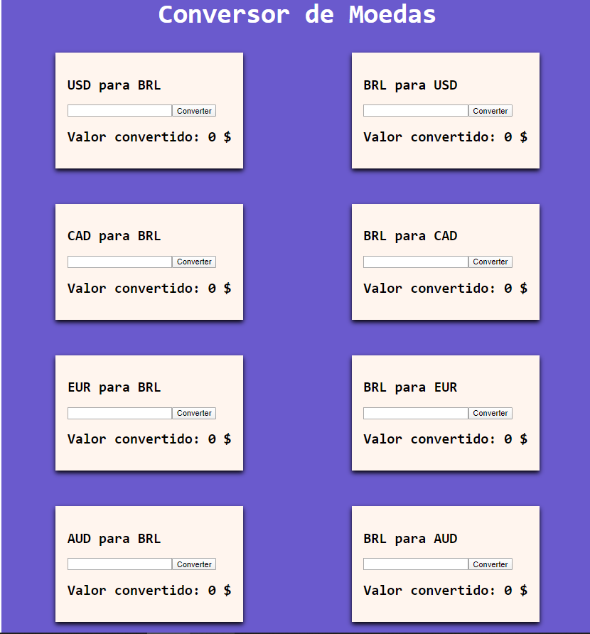

<h1 align="center">
 Conversor de moedas utilizando React 
  
</h1>

## Projeto  
  

    Conversor de moedas simples, que consome uma API específica para estar sempre atualizado.
  

## Tecnologias usadas 

- [Node.js](https://nodejs.org/en/)
- [React.js](https://reactjs.org)
- [Express](https://expressjs.com/pt-br/)
- [Nodemon](https://nodemon.io/)

## Como contribuir 

- Faça um fork desse repositório;
- Cria uma branch com a sua feature: `git checkout -b minha-feature`;
- Faça commit das suas alterações: `git commit -m 'feat: Minha nova feature'`;
- Faça push para a sua branch: `git push origin minha-feature`.

Depois que o merge da sua pull request for feito, você pode deletar a sua branch.

## :memo: Licença

Esse projeto está sob a licença MIT. Veja o arquivo [LICENSE](LICENSE.md) para mais detalhes.

---
<h2 align="center">
 Desenvolvido por: 
</h2>

 

